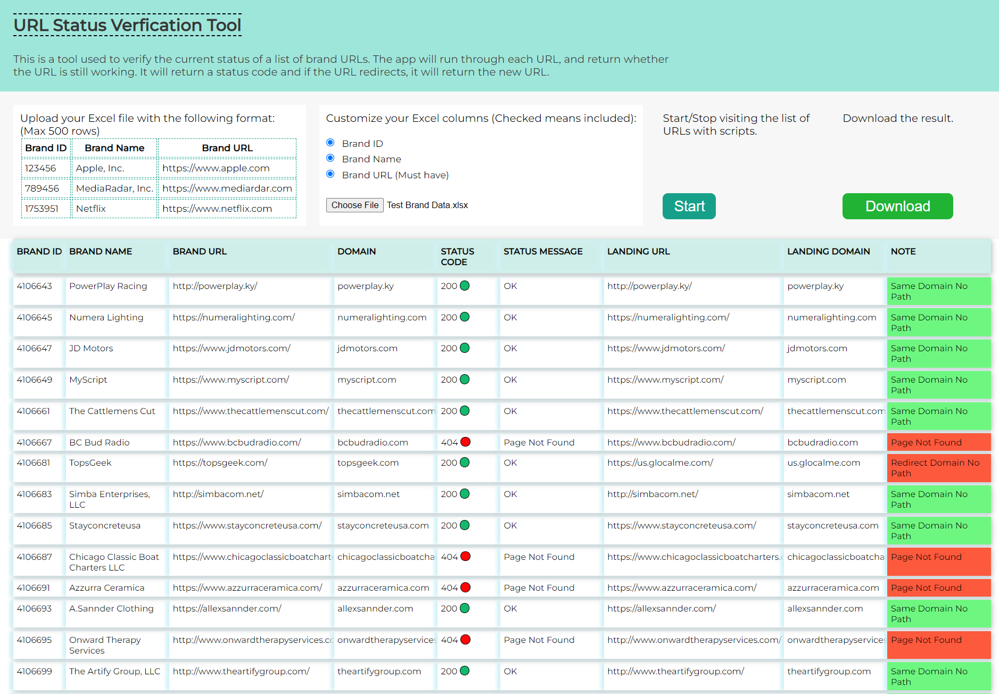

# Brand/business URL Verification Tool

## Links

- [Deployed Application](https://url-verification-tool.herokuapp.com/)

## Description
#### Brands and businesses come and go and evolve over time, and their URLs could change, become inactive or redirect to a new landing page. When you have a database of many brands and their information, some of those URLs could be outdated already. This tool serves the purpose of checking up on these URLS. A URL change for a business could mean the business underwent corporate change or simply went out of business. 

## How To Use
#### Users can upload an Excel xlsx file with the indicated column format. Then the tool will run through these business URLs and find out which are the ones that need updates or are no longer relevant. The tool responds with HTTP status code, message and a note about whether it was the same URL, redirected URL or page not found.

## How It Works
#### 
* Use package __read-excel-file__ to extract Excel file data 
* Then data will be populated in a table
* Start will send each URL to the backend server
* Backend uses __axios__ to make HTTP request
* Then response data will be populated in a table
* Download will be served by blob as CSV file

## Application Interface

